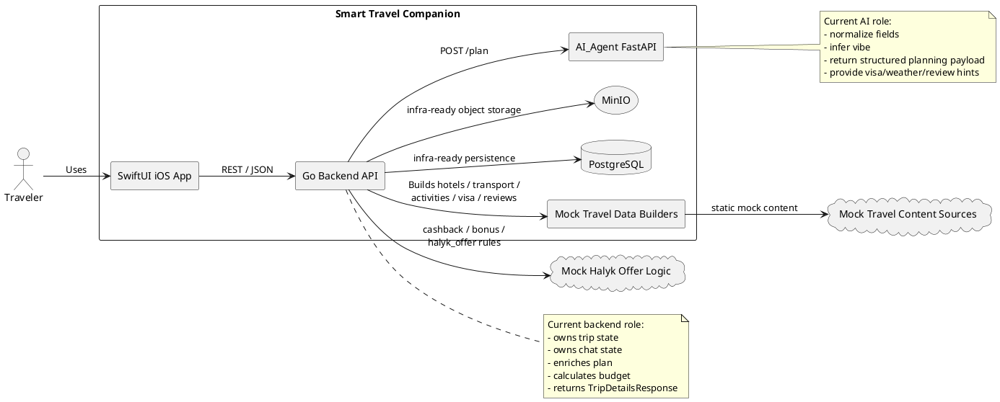
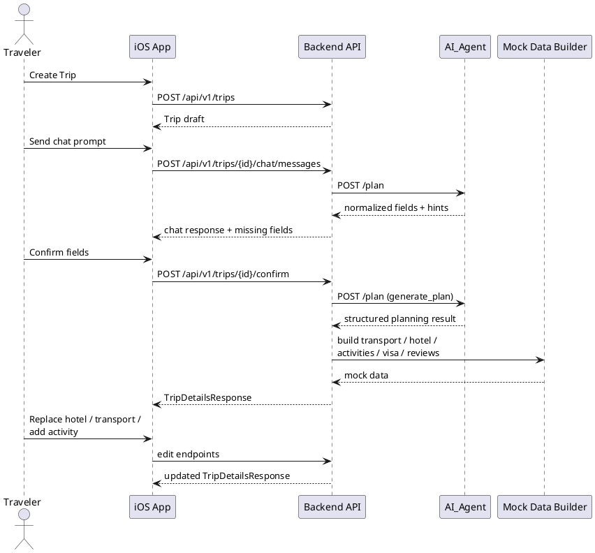
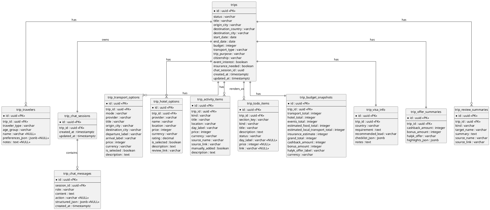

# Smart Travel Companion Architecture

## Overview

This document describes the architecture of the `Smart Travel Companion` hackathon prototype.

The prototype is intentionally hybrid:

- the application structure is production-like
- the product flow is end-to-end
- integrations are mock-driven
- trip state is backend-owned
- AI planning is delegated to a separate service

The current system has three main modules:

- `App/` - SwiftUI iOS prototype
- `backend/` - Go Fiber API
- `AI_Agent/` - FastAPI planning service

## Architecture Principles

### Core principles

- backend is the source of truth
- AI_Agent is stateless
- frontend consumes aggregate responses, not raw fragmented data
- trip planning is chat-first, but dashboard-driven after generation
- mock providers are used instead of live partner integrations

### Current prototype constraints

- no real booking
- no real payment
- no real Halyk banking integration
- no real Kino.kz API integration
- no live provider APIs
- no persistent database wiring for the trip module yet

The trip module currently uses in-memory repository state even though PostgreSQL and MinIO are present in infrastructure.

## Architecture Diagram



## C4 Diagram (Container Diagram)

```plantuml
@startuml
!include https://raw.githubusercontent.com/plantuml-stdlib/C4-PlantUML/master/C4_Container.puml

LAYOUT_WITH_LEGEND()

title Smart Travel Companion - Container Diagram

Person(traveler, "Traveler", "Creates trips, chats with AI, confirms plan, edits transport/hotel/activities")

System_Boundary(system, "Smart Travel Companion") {
  Container(app, "iOS App", "SwiftUI", "Notifications, Create Trip, AI intake, Confirm Trip, Trip Dashboard")

  Container(api, "Backend API", "Go + Fiber", "Owns trip and chat state, calls AI service, enriches trip data, calculates budget and mock Halyk values")

  Container(ai, "AI_Agent", "Python + FastAPI", "Stateless planning service for field normalization, trip reasoning, vibe extraction, visa/weather/review hints")

  Container(mockprovider, "Mock Provider Layer", "Static builders / synthetic data", "Transport, hotels, activities, visa data, review links, event links")

  ContainerDb(memoryrepo, "Trip State Store", "In-memory repository (current prototype)", "Trips, sessions, messages, options, activities, budget snapshots")

  ContainerDb(postgres, "PostgreSQL", "PostgreSQL", "Infrastructure-ready database, not yet primary store for trip module")

  ContainerDb(minio, "MinIO", "S3-compatible object storage", "Infrastructure-ready storage for future file or media flows")
}

System_Ext(halykmock, "Mock Halyk Offer Rules", "Mock cashback, bonus, and offer label calculation")

Rel(traveler, app, "Uses", "iOS UI")
Rel(app, api, "Calls REST API", "HTTPS / JSON")

Rel(api, ai, "Requests planning result", "HTTP / JSON")
Rel(api, mockprovider, "Builds mock travel data from", "In-process calls")
Rel(api, memoryrepo, "Stores and reads trip state", "In-memory")
Rel(api, postgres, "Future persistence target", "SQL")
Rel(api, minio, "Future storage target", "S3 API")
Rel(api, halykmock, "Calculates cashback / bonus / offer", "Mock rules")

note right of api
Main backend endpoints:
- POST /api/v1/trips
- POST /api/v1/trips/{id}/chat/messages
- POST /api/v1/trips/{id}/confirm
- POST /api/v1/trips/{id}/regenerate
- POST /api/v1/trips/{id}/options/.../select
- POST /api/v1/trips/{id}/activities
end note

note bottom of memoryrepo
Current prototype tradeoff:
the trip module persists state in memory
instead of PostgreSQL to keep the MVP fast.
end note

@enduml
```

## Backend Component Diagram

```plantuml
@startuml
!include https://raw.githubusercontent.com/plantuml-stdlib/C4-PlantUML/master/C4_Component.puml

LAYOUT_WITH_LEGEND()

title Smart Travel Companion - Backend Trip Module

Container_Boundary(backend, "Go Backend API / internal/trip") {
  Component(handler, "Handler", "Fiber handlers", "Exposes REST endpoints for trips, chat, options, budget, visa, and reviews")
  Component(service, "Service", "Business logic", "Coordinates planning, enrichment, selection, manual edits, and aggregate response building")
  Component(repository, "Repository", "In-memory repository", "Stores trips and chat sessions for the prototype")
  Component(plannerclient, "Planner Client", "HTTP client + fallback planner", "Calls AI_Agent or local fallback planner")
  Component(mockbuilder, "Mock Data Builder", "Synthetic data layer", "Builds transport, hotel, activities, visa, and review mock data")
  Component(budgetcalc, "Budget Calculator", "Calculation logic", "Calculates totals, cashback, bonus, and halyk_offer")
}

Component_Ext(aiagent, "AI_Agent FastAPI", "External service", "Structured planning endpoint")

Rel(handler, service, "Calls")
Rel(service, repository, "Reads/Writes state")
Rel(service, plannerclient, "Requests plan")
Rel(service, mockbuilder, "Enriches with mock travel data")
Rel(service, budgetcalc, "Calculates totals and offers")
Rel(plannerclient, aiagent, "POST /plan", "HTTP / JSON")

@enduml
```

## Runtime Sequence



## Responsibility Split

### Backend

Backend is responsible for:

- trip draft creation
- chat session management
- final trip state
- selected transport and hotel options
- manual activity additions
- budget totals
- cashback / bonus / `halyk_offer`
- aggregate dashboard response

### AI_Agent

AI_Agent is responsible for:

- conversational planning support
- normalization of user intent
- vibe extraction
- structured planning response
- visa/weather/review hint generation

### Mock data layer

The mock data layer is responsible for:

- destination-specific transport options
- hotel options
- places and event suggestions
- visa checklists
- review summaries and source links

## ERD (Entity Relationship Diagram)

The ERD below represents the logical target schema for the trip planning system. It is the intended data model even though the current MVP stores trip state in memory.



## Main Aggregate Contract

The frontend is designed to consume one aggregate response:

- `TripDetailsResponse`

That response contains:

- trip
- travelers
- todo_sections
- selected_transport
- selected_hotel
- activities
- budget
- visa
- review_summaries
- offers
- chat_entrypoints

This keeps the frontend simple and avoids joining independent raw resources on the client.

## Mock Geography

The current prototype is centered around four destinations:

- Kazakhstan
- Turkey
- UAE
- Japan

## Non-Goals

The current architecture does not implement:

- real booking engines
- real payment rails
- real Halyk financial integrations
- real Kino.kz integration
- split payment
- installment logic
- post-trip analytics
- durable trip persistence in PostgreSQL for the trip module
